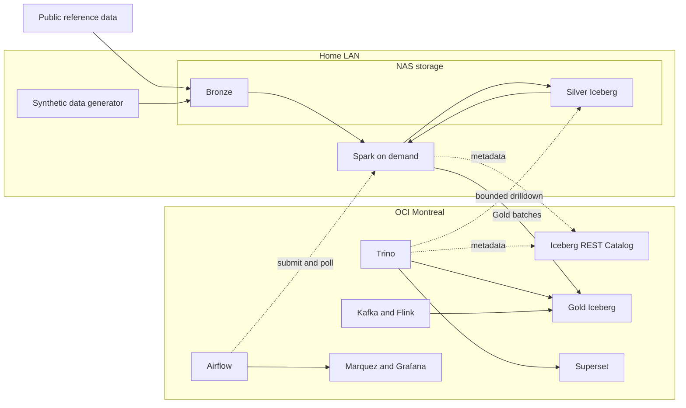

# Platform Architecture

> **Status**: Draft · **Date**: 2026-09-09
>
> 本文描述当前架构草案，不表示组件已经部署或接口已经冻结。
>
> **Decisions**: [ADR 0001](adr/0001-project-boundaries-and-system-context.md),
> [ADR 0002](adr/0002-transaction-centric-lakehouse-layering.md),
> [ADR 0003](adr/0003-hybrid-deployment-topology-and-component-placement.md),
> [ADR 0004](adr/0004-language-and-runtime-boundaries.md)

## 1. 架构目标

CMOP 需要在家庭实验环境中产生并处理 800 GB–1.5 TB 的资本市场运营数据，同时保留企业
数据平台最重要的行为：可重跑、可追溯、可对账、可重述、可观测，并能在有限资源下展示
交互式 Gold 查询与批内物化的差异解释链。

架构将大量、阵发的工作留在家庭局域网，将小体量、常驻和需要公网访问的能力放在 OCI。
这不是模拟生产多节点集群的规模，而是用明确约束展示存储、计算、控制面和服务面的边界。

## 2. 系统上下文

图中跨越 Home LAN 与 OCI 的虚线和 Gold 写入都经过 WireGuard。批量 Bronze/Silver 扫描
不允许跨越该边界。

## 3. 数据分层

| 层级 | 位置 | 形态 | 作用 |
|---|---|---|---|
| Bronze | NAS | 来源对齐的事件与原始标识 | 重放、审计、保留到达异常与原始语义 |
| Silver | NAS | Iceberg 明细事实与一致业务键 | Gold 重建、EDA、特征工程、定点追溯 |
| Gold | OCI 本地盘 | Iceberg 业务输出 | 对账、监管、风险、指标和交互查询 |

Silver 的首要消费者是 Spark，不是 BI 用户。Gold 固定常用业务粒度；Silver 保留足够细的
事实，以便在口径变化时重建 Gold，或回答 Gold 尚未预聚合的新问题。

## 4. 节点与组件

| 节点 | 当前硬件事实 | 草案职责 |
|---|---|---|
| NAS | 4 核 8 线程、16 GB、8 TB 可扩，7×24 | S3-compatible storage、Bronze、Silver；**常驻日增量执行端**；不承载查询引擎 |
| MacBook Pro | 规格待补，按需上线 | **首次全量回填、全量重算、宽扫描 EDA/特征工程、周期性 compaction**；本地 NVMe shuffle；driver 语言待定 |
| OCI Montreal | 4 核、24 GB、175 GB，7×24。**已被 UOIP 占用 16 GB 与 143 GB，见下** | 编排、Catalog、Gold、Trino、窄流处理、BI、血缘、监控和公网入口 |

> **2026-09-09 实测。** 该实例存在，规格属实：4 核 aarch64、23974 MB 内存、175 GB 根分区。
> **但它不是空的**，上面跑着 UOIP 与若干个人服务共 26 个容器，占用 16 GB 内存与 143 GB 磁盘。
> CMOP 实际可用约 7.9 GB 内存与 32 GB 磁盘，详见
> [技术选型评估要求](requirements/technology-selection-evaluation.md) §7.1.2。

NAS 对象存储当前偏好 SeaweedFS，但最终选择仍是 Proposed。兼容性与恢复能力比 GitHub
热度更重要，接受前需要用 Spark、Iceberg 和 Trino 进行实测。

### 4.1 为什么 NAS 可以承担日增量

早期草案写的是"NAS 不承载计算"。该表述在 TB 级批处理语境下成立，在日增量语境下过严，
现按数据量分级修正。

日增量规模的推导见 [工作负载基线](workload-baseline.md) §1.1：按十年、每年 250 交易日
摊平，日增量约 200–360 MB，是目标总量的万分之四量级。这个量级不需要按需算力节点。

内存分配的粗略边界：SeaweedFS 约 2–4 GB，其余约 10 GB 留给增量作业进程。该分配是
规划假设，进入 Phase 1 前必须用实际 RSS 与峰值测量替换。

MBP 只在三种情况下上线：首次全量回填、需要全量重算的纠错、周期性 compaction。日常
增量不依赖 MBP 在线。

### 4.2 编排只有一套，且只在 OCI

NAS 上安装的是**执行端**，不是第二个调度器。理由：

1. 网络边界（§6）已经把 Airflow task 限定为远程提交加轮询，跨节点提交本来就是设计前提，
   NAS 只需要一个可接收作业的入口。
2. 两套调度器会把运行血缘割成两段，OpenLineage/Marquez 无法拼出完整链路，而逐笔追溯
   依赖完整血缘。
3. OCI 24 GB 内存预算（§8）无法再容纳第二套 Airflow。

是否复用 UOIP 既有 Airflow 实例是另一个问题，仍在 §10 开放项中。

### 4.3 复用 UOIP 既有实例还是独立部署

2026-09-09 的实测确认那台 OCI 主机上已运行 Trino 451、Airflow、Spark 3.5.1、Flink 1.18.1、
Kafka 7.6.0、Superset、Hive Metastore 与 Postgres 15。**复用的对象是具体存在的**，不是假设。
容量一度看起来会替我们做决定，但所有者确认可回收，因此这仍是一个取舍。

**支持复用**

1. 少一套常驻栈，直接降低运维负担。评估口径是"一个兼职的人"，见
   [技术选型评估要求](requirements/technology-selection-evaluation.md) §4 第 4 条。
2. 与 §4.2 的论证同向：只有一套编排，运行血缘才能拼成完整链路。
3. 这些组件已在 aarch64 上跑通，**镜像可用性这一类问题已被别人踩过**。

**支持独立部署**

1. **爆炸半径。** CMOP 的一次性 probe 若压垮共享 Airflow 或 Trino，连带打断 UOIP。probe
   按定义是可丢弃实验，让它有能力影响另一个项目是坏交易。
2. **版本被锁死。** 复用意味着 CMOP 只能用 UOIP 当前的 Trino 451 与 Spark 3.5.1，而
   [ADR 0004](adr/0004-language-and-runtime-boundaries.md) 的 LTS JDK 选择恰恰依赖引擎版本。
   独立部署才谈得上按兼容性证据选版本。
3. **可复现性。** 本项目的主张是可重跑、可追溯。运行在一套会被另一个项目随时改动的环境上，
   "同种子同结果"就少了一层保障。

**已定案：OCI 侧全面复用，Catalog 除外。** 见
[ADR 0003 的 2026-09-09 修订](adr/0003-hybrid-deployment-topology-and-component-placement.md)。

决定性的理由不是容量，而是**重活已经不在 OCI**：首次回填与全量重算归 MBP，见 §4.1，OCI 侧
Spark 绝大多数时间空闲，为一个长期空闲的角色养第二套部署不划算。爆炸半径的代价被显式接受，
接受的是可用性风险，不是正确性风险。

**复用不是零成本，三项已查实**：那台 Spark 完全没有 Iceberg，需要加 runtime；既有 Trino 的
iceberg catalog 指向 Hive Metastore，CMOP 要在同一个 Trino 里另加独立 catalog，新增通常需
重启；Spark 镜像跑在 JDK 11，[ADR 0004](adr/0004-language-and-runtime-boundaries.md) 的
JDK 选择因此被约束。

## 5. 查询与计算路径

| 工作负载 | 执行位置 | 允许访问模式 |
|---|---|---|
| 固定报表、Dashboard、Gold 分析 | OCI Trino | 本地读取 Gold |
| 对账差异的解释链 | 夜间批次内物化进 Gold | 交互查询只读 Gold，**不跨隧道** |
| 多年 EDA、特征工程、Gold 重建 | MBP Spark | 在家庭局域网宽扫描 Silver |
| Silver 逐笔下钻 | 局域网内 Spark 或本地引擎 | **仅工程排查用途，不作为对外能力** |

因此 NAS 不安装 Trino。需要多年扫描的新问题由按需 Spark 节点处理。

### 5.1 下钻边界的决定

**已定案：对外能力不跨隧道。** 差异的解释链在夜间批次内计算并物化进 Gold，交互路径只读
Gold。Silver 的逐笔下钻降为局域网内的工程排查手段，不进入对外演示范围。

理由四条：

1. **更接近真实运营。** 真实中后台的差异解释是批内预先算好的，不是分析员每点一次就现场
   推一遍血缘。
2. **把最脆弱的一环从演示主路径上摘掉。** Silver 在 NAS、Trino 在 OCI，穿隧道下钻的延迟
   比 Gold 查询高一个量级，且依赖演示当时家里的隧道可用。
3. **追溯性没有被削弱，反而增强。** 解释链与其他结果在同一批次算出、一起版本化、一起被
   重述，因此可复现。按点击实时推导的血缘做不到这一点。
4. **实时重算血缘在规模上本来就会炸。** 把它排除掉是设计取舍，不是能力缺失。

两条必须同时接受的代价：

- **Gold 会出现一张明细粒度的异常解释表。** 这是对[工作负载基线](workload-baseline.md) §3
  "Gold 超预算先查是否混入明细粒度"那条的**显式例外**，必须挂号并单独监控行数与字节数。
  它的行数由异常条数决定而非事实条数，量级远小于事实表，但增长率要单独盯。
- **解释链在批内无法确定时必须显式标记。** 例如原因事件尚未到达。该条异常标记为"解释待
  补"，不得留空。空值会被读成"没有原因"，与数据质量里 pass、fail、not evaluated 三分类
  同源。

本节是访问模式决定，尚未提升为 ADR。若后续 Gold 表设计因此产生独立的可逆取舍，再评估
是否单独立 ADR。

## 6. 网络边界

WireGuard 隧道上的正常流量只有：

1. Airflow 提交 Spark 作业并低频轮询状态。
2. Spark 将聚合后的 Gold 批次写入 OCI。
3. Spark、Trino 与 Iceberg REST Catalog 交换 KB 级元数据。
4. 不含任何 Silver 下钻。§5.1 已决定对外交互路径只读 Gold，跨隧道读 Silver 的能力保留在
   架构里，但不作为对外能力使用。

Airflow task 不得在 OCI 进程内枚举 Bronze/Silver 对象。需要宽扫描的审计和校验必须提交
给家庭侧 Spark。少量公开参考数据的摄取可以在 OCI 运行，但不能演变为 TB 级搬运路径。

## 7. 执行约束

- Spark 使用 cluster mode，driver 不落在 OCI。
- Shuffle 与 spill 显式指向 MBP 本地 NVMe，不指向 NAS 挂载目录。
- 跨隧道查询只读 Gold。保留的 Silver 读取能力仅用于工程排查，触及对象数必须有界，
  Iceberg 裁剪是必要条件而非无限扫描许可。
- Pipeline 以批次整体可重跑为基础，不假设 MBP 7×24 在线。**整体可重跑是能力，不是
  日常运行方式**：日常只重算受影响批次，全量重算是纠错时的兜底手段。可重跑与增量处理
  是正交属性，不因为支持重跑就放弃增量。
- 增量写入必须是按主键的 `MERGE INTO`，不得使用纯 append。T+1 确认迟到、更正和公司
  行为都会改写已提交的历史分区。
- 增量与回填必须共用同一份处理代码，只有 batch 数量不同。两套实现会让回填结果与增量
  结果出现无法解释的差异，而对账正是本项目的主 BO。
- 迟到不依赖真实时间流逝模拟。每个事件同时携带业务发生时间与进入批次标识，迟到定义为
  后者晚于前者所属批次，使重跑后迟到现象仍可精确复现。
- 日增量持续产生小文件，compaction 必须是独立排期的周期性作业，不能依赖顺带完成。
- Gold 由 Spark 构建，Trino 主要只读服务。
- Kafka/Flink 只承载窄窗口演示或回放，不承载多年历史生成。
- CMOP 使用独立 REST Catalog，不与 UOIP 共用 Hive Metastore。实测确认既有 Trino 已有一个
  指向 Hive Metastore 的 iceberg catalog；CMOP 在同一个 Trino 内新增独立 catalog，两个项目
  的表因此互不可见。

## 8. 容量与资源约束

目标总数据量、各层预算与测量计划见 [workload-baseline.md](workload-baseline.md)。
当前 Gold 预算为 40 GB；超过预算首先视为粒度或保留策略信号，而不是直接扩盘理由。

> **2026-09-09 实测 32 GB 空闲，但不构成阻塞。** 所有者说明 OCI 上没有存储业务数据，清理可
> 释放 100 GB 以上；内存亦可通过下掉未使用容器与迁走两个个人服务腾出。**该回收量是计划不是
> 测量**，条件为现有架构不变，部署前必须复测实际可用量。

**原先记的约 21 GB 粗略预算已被推翻，但推翻它的是实测而不是纸面加法。**
[技术选型评估要求](requirements/technology-selection-evaluation.md) §7.1 用各项目自己发布的
内存要求做了一次纸面筛：仅 Trino 按其 Kubernetes 部署的典型 8 GB、Airflow 按其文档的最低
4 GB，两项就占掉 24 GB 的一半，而流式、BI、血缘、两个数据库与操作系统尚未计入。

实测结果是：这套组合本身只占约 7.6 GB，比纸面估算低三倍，**在空机器上完全装得下**。问题
不在组件大小，在于这台机器已被 UOIP 占掉 16 GB。

**因此约束从"组件太大"变成"机器已被占用"**，可用内存约 7.9 GB，与这套组合的实测占用几乎
相等。结论是不能再起一套平行的栈，只能复用。

容量可回收之后，另起一套栈重新可行，因此复用与独立部署成为一个需要论证的取舍，见 §4.3。
轻候选仍应评估，理由是运维负担而非容量，见
[技术选型评估要求](requirements/technology-selection-evaluation.md) §4 第 4 条。

## 9. 可观测性与治理

- Airflow 记录批次状态，但实际 Spark 作业状态必须从远程执行端回传。
- OpenLineage/Marquez 保存跨层运行血缘；Gold 结果还需要业务键与规则版本支撑逐笔追溯。
- Grafana 展示基础设施与作业指标；数据质量结果不能只作为日志文本存在。
- Iceberg snapshot 支持 time travel，但必须制定保留与过期策略，防止规划元数据持续膨胀。
- 对象存储需要独立备份与恢复演练，不能把单台 NAS 当成已经完成的数据保护。

## 10. 开放项

- Gold 输出边界（主 BO 的暂定排序见 [业务目标](requirements/business-objectives.md)）。
- MBP 规格和实测批处理能力。
- 对象存储最终实现及其 S3/Iceberg 兼容性。
- Snapshot、compaction、小文件与 Catalog 维护策略，含 compaction 的执行节点与周期。
- Gold 写入 OCI 的提交、回滚和重试协议。
- 局域网内 Silver 逐笔下钻的查询门禁形式。对外路径已由 §5.1 排除，此项只剩工程排查场景，
  优先级相应下降。
