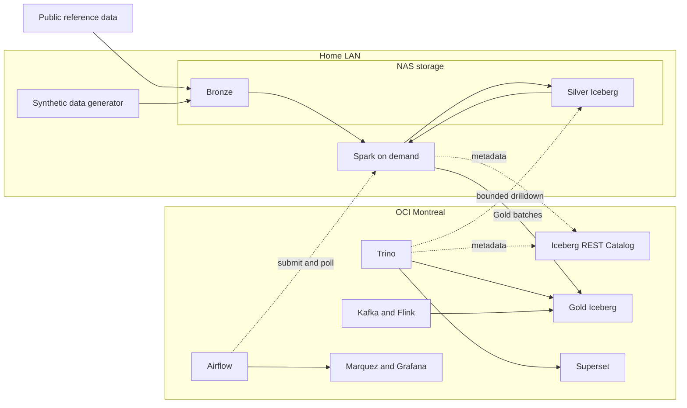

# Platform Architecture

> **Status**: Draft · **Date**: 2026-09-02
>
> 本文描述当前架构草案，不表示组件已经部署或接口已经冻结。
>
> **Decisions**: [ADR 0001](adr/0001-project-boundaries-and-system-context.md),
> [ADR 0002](adr/0002-transaction-centric-lakehouse-layering.md),
> [ADR 0003](adr/0003-hybrid-deployment-topology-and-component-placement.md)

## 1. 架构目标

CMOP 需要在家庭实验环境中产生并处理 800 GB–1.5 TB 的资本市场运营数据，同时保留企业
数据平台最重要的行为：可重跑、可追溯、可对账、可重述、可观测，并能在有限资源下展示
交互式 Gold 查询和有界 Silver 下钻。

架构将大量、阵发的工作留在家庭局域网，将小体量、常驻和需要公网访问的能力放在 OCI。
这不是模拟生产多节点集群的规模，而是用明确约束展示存储、计算、控制面和服务面的边界。

## 2. 系统上下文

图中跨越 Home LAN 与 OCI 的虚线和 Gold 写入都经过 WireGuard。批量 Bronze/Silver 扫描
不允许跨越该边界。

## 3. 数据分层

| 层级 | 位置 | 形态 | 作用 |
|---|---|---|---|
| Bronze | NAS | 来源对齐的事件与原始标识 | 重放、审计、保留到达异常与原始语义 |
| Silver | NAS | Iceberg 明细事实与一致业务键 | Gold 重建、EDA、特征工程、定点追溯 |
| Gold | OCI 本地盘 | Iceberg 业务输出 | 对账、监管、风险、指标和交互查询 |

Silver 的首要消费者是 Spark，不是 BI 用户。Gold 固定常用业务粒度；Silver 保留足够细的
事实，以便在口径变化时重建 Gold，或回答 Gold 尚未预聚合的新问题。

## 4. 节点与组件

| 节点 | 当前硬件事实 | 草案职责 |
|---|---|---|
| NAS | 4 核 8 线程、16 GB、8 TB 可扩，7×24 | S3-compatible storage、Bronze、Silver；不承载计算或查询引擎 |
| MacBook Pro | 规格待补，按需上线 | PySpark 生成、Silver/Gold 批处理、宽扫描 EDA/特征工程、本地 NVMe shuffle |
| OCI Montreal | 4 核、24 GB、200 GB，7×24 | 编排、Catalog、Gold、Trino、窄流处理、BI、血缘、监控和公网入口 |

NAS 对象存储当前偏好 SeaweedFS，但最终选择仍是 Proposed。兼容性与恢复能力比 GitHub
热度更重要，接受前需要用 Spark、Iceberg 和 Trino 进行实测。

## 5. 三种查询与计算路径

| 工作负载 | 执行位置 | 允许访问模式 |
|---|---|---|
| 固定报表、Dashboard、Gold 分析 | OCI Trino | 本地读取 Gold |
| 合规下钻、对账差异逐笔解释 | OCI Trino | 通过 manifest 裁剪读取少量 Silver 对象；必须有强谓词 |
| 多年 EDA、特征工程、Gold 重建 | MBP Spark | 在家庭局域网宽扫描 Silver |

因此 NAS 不安装 Trino。下钻只是现有 OCI Trino 的受限能力；需要多年扫描的新问题由
按需 Spark 节点处理。

## 6. 网络边界

WireGuard 隧道上的正常流量只有：

1. Airflow 提交 Spark 作业并低频轮询状态。
2. Spark 将聚合后的 Gold 批次写入 OCI。
3. Spark、Trino 与 Iceberg REST Catalog 交换 KB 级元数据。
4. 演示或合规工作流按主键、事件 ID 或窄时间窗口下钻 Silver。

Airflow task 不得在 OCI 进程内枚举 Bronze/Silver 对象。需要宽扫描的审计和校验必须提交
给家庭侧 Spark。少量公开参考数据的摄取可以在 OCI 运行，但不能演变为 TB 级搬运路径。

## 7. 执行约束

- Spark 使用 cluster mode，driver 不落在 OCI。
- Shuffle 与 spill 显式指向 MBP 本地 NVMe，不指向 NAS 挂载目录。
- 单条跨隧道查询触及的对象数必须有界；Iceberg 裁剪是必要条件，不是无限扫描许可。
- Pipeline 以批次整体可重跑为基础，不假设 MBP 7×24 在线。
- Gold 由 Spark 构建，Trino 主要只读服务。
- Kafka/Flink 只承载窄窗口演示或回放，不承载多年历史生成。
- CMOP 使用独立 REST Catalog，不与 UOIP 共用 Hive Metastore。

## 8. 容量与资源约束

目标总数据量、各层预算与测量计划见 [data-volume-baseline.md](data-volume-baseline.md)。
当前 Gold 预算为 40 GB；超过预算首先视为粒度或保留策略信号，而不是直接扩盘理由。

OCI 24 GB 需要同时容纳多个常驻组件，现有约 21 GB 的粗略预算缺少实际 RSS 与峰值测量，
不能作为最终容量承诺。Airflow 是否复用、Kafka/Flink 是否同时常驻都需在实施前验证。

## 9. 可观测性与治理

- Airflow 记录批次状态，但实际 Spark 作业状态必须从远程执行端回传。
- OpenLineage/Marquez 保存跨层运行血缘；Gold 结果还需要业务键与规则版本支撑逐笔追溯。
- Grafana 展示基础设施与作业指标；数据质量结果不能只作为日志文本存在。
- Iceberg snapshot 支持 time travel，但必须制定保留与过期策略，防止规划元数据持续膨胀。
- 对象存储需要独立备份与恢复演练，不能把单台 NAS 当成已经完成的数据保护。

## 10. 开放项

- 主 BO 与 Gold 输出边界。
- MBP 规格和实测批处理能力。
- 对象存储最终实现及其 S3/Iceberg 兼容性。
- Airflow 是否复用既有实例。
- Snapshot、compaction、小文件与 Catalog 维护策略。
- Gold 写入 OCI 的提交、回滚和重试协议。
- Silver 下钻的查询门禁如何在 Trino 层强制执行。
